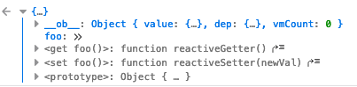
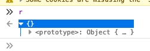
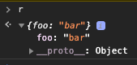

# Firefox / Chrome `sendMessage` response incompatibility

This is a simple example showing a difference between Firefox and Google Chrome's `sendMessage` response behaviors. I
came across this issue when migrating a Chrome Extension over to Firefox.

## Background

In this sample code, I'm using [Vuex](https://vuex.vuejs.org/) in my Background Script as a data store. Vuex wraps
basic Javascript objects with reactive getters and setters, which exposes the problem. So, when a plain ol' Javascript
object is defined in the Vuex Store's `state`, it is automatically transformed.

In this example (see [`bg.js`](bg.js)), `myObj` in the `state` is defined like this:

```js
const store = new Vuex.Store({
  state: {
    myObj: {
      foo: 'bar'
    },
  },
});
```

If you inspect the object fetched from the store (`store.state.myObj`), you'll see the `foo` property is automatically
wrapped with `reactiveGetter` and `reactiveSetter`.



## The Issue

The difference between Firefox and Google Chrome is exposed when a Vuex object is pulled from `state` and sent as a
response to a `sendMessage` call from a Content Script (see [`bg.js`](bg.js) and [`cs.js`](cs.js)).

### Firefox

On Firefox, the response is an empty object with no properties.



### Google Chrome

On Google Chrome, the response contains the expected property (though the `getters` and `setters` are removed).



## Using This Repository

To use this repository to reproduce the problem:

1. Clone this repository.

1. Load up the `manifest.json` as a temporary addon in Firefox or as a Developer Extension in Google Chrome.

1. Visit [https://developer.mozilla.org/en-US/](https://developer.mozilla.org/en-US/).

1. Open the Javascript console. The contents of the `sendMessage` response are logged using `console.dir`.

Note that Google Chrome has the `foo` property defined in the response, while Firefox does not.
